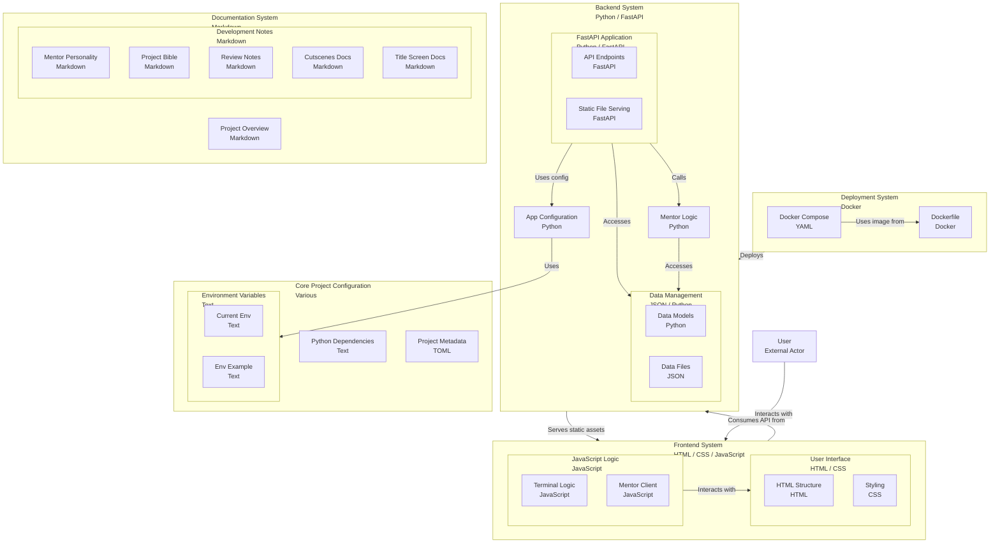

# v0.1-Overview Diagram

```mermaid
graph TD

    12["User<br>External Actor"]
    subgraph 1["Core Project Configuration<br>Various"]
        31["Python Dependencies<br>Text"]
        32["Project Metadata<br>TOML"]
        subgraph 2["Environment Variables<br>Text"]
            33["Current Env<br>Text"]
            34["Env Example<br>Text"]
        end
    end
    subgraph 3["Documentation System<br>Markdown"]
        25["Project Overview<br>Markdown"]
        subgraph 4["Development Notes<br>Markdown"]
            26["Mentor Personality<br>Markdown"]
            27["Project Bible<br>Markdown"]
            28["Review Notes<br>Markdown"]
            29["Cutscenes Docs<br>Markdown"]
            30["Title Screen Docs<br>Markdown"]
        end
    end
    subgraph 5["Deployment System<br>Docker"]
        23["Dockerfile<br>Docker"]
        24["Docker Compose<br>YAML"]
        %% Edges at this level (grouped by source)
        24["Docker Compose<br>YAML"] -->|Uses image from| 23["Dockerfile<br>Docker"]
    end
    subgraph 6["Frontend System<br>HTML / CSS / JavaScript"]
        subgraph 7["JavaScript Logic<br>JavaScript"]
            21["Terminal Logic<br>JavaScript"]
            22["Mentor Client<br>JavaScript"]
        end
        subgraph 8["User Interface<br>HTML / CSS"]
            19["HTML Structure<br>HTML"]
            20["Styling<br>CSS"]
        end
        %% Edges at this level (grouped by source)
        7["JavaScript Logic<br>JavaScript"] -->|Interacts with| 8["User Interface<br>HTML / CSS"]
    end
    subgraph 9["Backend System<br>Python / FastAPI"]
        15["App Configuration<br>Python"]
        16["Mentor Logic<br>Python"]
        subgraph 10["Data Management<br>JSON / Python"]
            17["Data Models<br>Python"]
            18["Data Files<br>JSON"]
        end
        subgraph 11["FastAPI Application<br>Python / FastAPI"]
            13["API Endpoints<br>FastAPI"]
            14["Static File Serving<br>FastAPI"]
        end
        %% Edges at this level (grouped by source)
        11["FastAPI Application<br>Python / FastAPI"] -->|Accesses| 10["Data Management<br>JSON / Python"]
        11["FastAPI Application<br>Python / FastAPI"] -->|Uses config| 15["App Configuration<br>Python"]
        11["FastAPI Application<br>Python / FastAPI"] -->|Calls| 16["Mentor Logic<br>Python"]
        16["Mentor Logic<br>Python"] -->|Accesses| 10["Data Management<br>JSON / Python"]
    end
    %% Edges at this level (grouped by source)
    15["App Configuration<br>Python"] -->|Uses| 2["Environment Variables<br>Text"]
    9["Backend System<br>Python / FastAPI"] -->|Serves static assets| 6["Frontend System<br>HTML / CSS / JavaScript"]
    12["User<br>External Actor"] -->|Interacts with| 6["Frontend System<br>HTML / CSS / JavaScript"]
    5["Deployment System<br>Docker"] -->|Deploys| 9["Backend System<br>Python / FastAPI"]
    6["Frontend System<br>HTML / CSS / JavaScript"] -->|Consumes API from| 9["Backend System<br>Python / FastAPI"]
```
